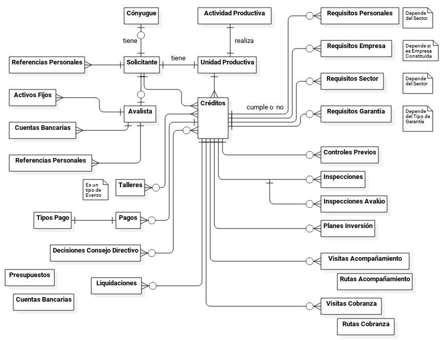

***************
Diseño de Datos
***************

La estructura y modelado de datos del sistema TINJACA se realizó a partir de los formatos y planillas que utilizan las
diferentes gerencias y dependencias del FOMDES, así como las que son incorporadas en los expedientes en las diferentes
fases del crédito. La información contenida en dichas planillas se incluyen en el Apéndice del presente informe.

Modelo de Datos
===============

El modelo de datos del sistema Tinjacá está centrado en los **Créditos** ya que sus actividades se centran en la
actualidad en el otorgamiento de los créditos y su recuperación.

Los procesos se inician en por uno de los **Solicitantes** el cual está relacionado a una de las **Unidades
Productivas** que realizan cada una, una de las **Actividades Productivas** en virtud de la cual solicita el crédito.

Para efectos legales se requieren los datos de su **Cónyugue** si la tiene y de un **Avalista** si lo requiere.

Tanto de cada uno de los **Solicitantes** como de su respectivo avalista se necesitan uno o mas requisitos como
**Referencias Personales**, **Activos Fijos** y **Cuentas Bancarias** que permitan constatar su solvencia financiera y
capacidad de pago.

El **Solicitante** busca acceder al crédito a través de la **Unidad Productiva**, sujeto cada uno a uno de los **Planes
Inversión**.

Los solicitantes una vez superen un revisión de factibilidad son invitados una o mas veces a los **Talleres** que se
planifican regularmente para una cierta cantidad de solicitudes de **Créditos**. La invitación a los **Talleres**
incluye una lista de requisitos a consignar.

Durante el proceso de aprobación del crédito el solicitante debe consignar una serie de **Requisitos Personales**,
**Requisitos Empresa** relativos a la **Unidad Productiva**, **Requisitos Sector** propios de cada sector productivo y
**Requisitos Garantía** relacionados con la Garantía utilizada en la solicitud.

Una vez consignados los requisitos se verifica una o mas veces si cumple el **Controles Previos** que realizan los
Analistas Jurídicos, y se realiza una o mas veces la **Inspecciones** e **Inspecciones de Avalúo** que realizan los
Analistas Económicos.

Las solicitudes de **Créditos** esperan las **Decisiones Consejo Directivo** para ser aprobados (o no), en cada Consejo
Directivo se delibera sobre uno o mas **Créditos**, y una solicitud de crédito podría requerir una o mas **Decisiones
Consejo Directivo** para ser aprobados.

La aprobación de estos **Créditos** está sujeta a las disponibilidades financieras y presupuestarias en relación a los
**Presupuestos** anuales, y la disponibilidad en las **Cuentas Bancarias**.

Una vez aprobados, para cada uno de los **Créditos** se realizan las **Liquidaciones** en una o mas partes. Y esto
activa las **Visitas de Acompañamiento** realizadas por personal de la Gerencia de Crédito para verificar el
cumplimiento de su plan de inversión, y las **Visitas de Cobranza** realizadas por el personal de la Gerencia de
Recuperaciones para recoger pagos, en particular de los **Solicitantes** morosos.

Estas visitas requieren la elaboración de un calendario de **Rutas Acompañamiento** y **Rutas Cobranza** para las cuales
se asignan funcionarios a distintos municipios del Estado Mérida.

Para cada uno de los **Créditos** se reciben **Pagos** hasta su cancelación total.

Si bien las transacciones que generan asientos contables como las **Liquidaciones** o los **Pagos** son relativamente
simples, implementar la contabilidad requeriría la incluir todos los gatos operativos de FOMDES incluyendo la nómina.

----

*Modelo de Datos del Sistema Tinjacá*

----

Diccionario de Datos
====================

Solicitantes
------------

    .. tabularcolumns:: |p{4cm}|p{7cm}|

    .. list-table::
       :widths: 40 70
       :header-rows: 1

       * - | Campo
         - | Tipo de dato
       * - Código
         - Numérico
       * - Nombres
         - Cadena
       * - Apellidos
         - Cadena
       * - CI
         - Numérico
       * - RIF
         - AlfaNumérico
       * - Fecha_Nacimiento
         - Fecha
       * - Edad
         - Numérico
       * - Sexo
         - Carácter
       * - Dirección_Habitación
         - Cadena
       * - Municipio
         - Cadena
       * - Parroquia
         - Cadena
       * - Profesión_Oficio
         - Cadena
       * - Teléfono_Fijo
         - Cadena
       * - Teléfono_Celular
         - Cadena
       * - Correo_Electrónico
         - Cadena

Unidades Productivas
--------------------

    .. list-table::
       :widths: 40 70
       :header-rows: 1

       * - | Campo
         - | Tipo de dato
       * - Código
         - Numérico
       * - Nombre_Unidad_Productiva
         - Cadena
       * - Dirección_UP
         - Cadena
       * - Teléfono_Fijo
         - Numérico
       * - Teléfono_Celular
         - Numérico
       * - Actividad
         - Cadena
       * - Experiencia
         - Cadena
       * - Área_Geográfica
         - Cadena
       * - Área_Funcionamiento
         - Numérico
       * - Tenencia
         - Cadena
       * - Área_M2
         - Numérico
       * - Zona_Geográfica
         - Cadena
       * - Servicios
         - Cadena
       * - Código_Solicitante
         - Numérico

Actividad productiva
--------------------

    .. list-table::
       :widths: 40 70
       :header-rows: 1

       * - | Campo
         - | Tipo de dato
       * - Código
         - Numérico
       * - Producto_Derivado
         - Cadena
       * - Materia_Prima
         - Cadena
       * - Donde_Y_Como_obtiene_PM
         - Cadena
       * - Precio_Venta_Producto
         - Numérico
       * - Distribución_Sistema _Ventas
         - Cadena
       * - Numero_de _Trabajadores
         - Numérico
       * - Puestos_Trabajo_Generar
         - Numérico
       * - Código_UnidadProductiva
         - Numérico

Plan de inversión
-----------------

    .. list-table::
       :widths: 40 70
       :header-rows: 1

       * - | Campo
         - | Tipo de dato
       * - Código
         - Numérico
       * - Capital_de_trabajo
         - Cadena
       * - Materia_Prima
         - Cadena
       * - Mano_de_Obra
         - Numérico
       * - Gastos_de_Constitución
         - Numérico
       * - Inversiones_Fijas
         - Cadena
       * - Ampliación_o_Remodelación
         - Cadena
       * - Maquinaria
         - Cadena
       * - Equipo
         - Numérico
       * - Utensilios_herramientas_menores
         - Cadena
       * - Otros
         - Cadena
       * - Inversión_Total
         - Cadena
       * - Código_ActividadProductiva
         - Numérico

Cónyuges
--------

    .. list-table::
       :widths: 40 70
       :header-rows: 1

       * - | Campo
         - | Tipo de dato
       * - Código
         - Numérico
       * - Cedula_Identidad
         - Cadena
       * - Nombres
         - Cadena
       * - Apellidos
         - Cadena
       * - Nacionalidad
         - Numérico
       * - Estado_Civil
         - Numérico
       * - Grado_Instrucción
         - Cadena
       * - Condición_Vivienda
         - Cadena
       * - Dirección_Habitación
         - Cadena
       * - Municipio
         - Numérico
       * - Teléfono_Habitación
         - Cadena
       * - Teléfono_Celular
         - Cadena
       * - FAX
         - Cadena
       * - Correo_Electrónico
         - Cadena
       * - Observaciones
         - Cadena
       * - Código_Solicitante
         - Numérico

Referencias personales y familiares
-----------------------------------

    .. list-table::
       :widths: 40 70
       :header-rows: 1

       * - | Campo
         - | Tipo de dato
       * - Código
         - Numérico
       * - Cedula_Identidad
         - Cadena
       * - Nombres
         - Cadena
       * - Apellidos
         - Cadena
       * - Dirección_Habitación
         - Cadena
       * - Municipio
         - Numérico
       * - Teléfono_Habitación
         - Cadena
       * - Teléfono_Celular
         - Cadena
       * - Código_Solicitante
         - Numérico

Avalistas
---------

    .. list-table::
       :widths: 40 70
       :header-rows: 1

       * - | Campo
         - | Tipo de dato
       * - Código
         - Numérico
       * - Cedula_Identidad
         - Numérico
       * - Nombres
         - Cadena
       * - Apellidos
         - Cadena
       * - Dirección_Habitación
         - Cadena
       * - Teléfono_Fijo
         - Numérico
       * - Teléfono_Celular
         - Numérico
       * - Nombre_Dirección_Trabajo
         - Cadena
       * - Cargo
         - Cadena
       * - Ingreso_Mensual
         - Numérico
       * - Otros_Ingresos
         - Numérico
       * - Total_Ingresos
         - Numérico
       * - Código_Solicitante
         - Numérico

Cuentas Bancarias Avalista
--------------------------

    .. list-table::
       :widths: 40 70
       :header-rows: 1

       * - | Campo
         - | Tipo de dato
       * - Código
         - Numérico
       * - Nro_Cuenta
         - Numérico
       * - Nombre_Banco
         - Cadena
       * - Tipo_Cuenta
         - Cadena
       * - Monto
         - Numérico
       * - Código_Avalista
         - Numérico

Activos fijos Avalista
----------------------

    .. list-table::
       :widths: 40 70
       :header-rows: 1

       * - | Campo
         - | Tipo de dato
       * - Código
         - Numérico
       * - Activo
         - Cadena
       * - Titulo
         - Cadena
       * - Avaluo
         - Numérico
       * - Código_Avalista
         - Numérico

Talleres
--------

    .. list-table::
       :widths: 40 70
       :header-rows: 1

       * - | Campo
         - | Tipo de dato
       * - Código
         - Numérico
       * - Fecha_Taller
         - Fecha
       * - Atendido_Por
         - Cadena

Garantías
---------

    .. list-table::
       :widths: 40 70
       :header-rows: 1

       * - | Campo
         - | Tipo de dato
       * - Código
         - Numérico
       * - Nro_Expediente
         - AlfaNumérico
       * - Tipo_Garantía
         - Cadena
       * - Descripcion
         - Cadena
       * - Avaluo
         - Numérico
       * - Código_Crédito
         - Numérico

Requisitos personales
---------------------

    .. list-table::
       :widths: 40 70
       :header-rows: 1

       * - | Campo
         - | Tipo de dato
       * - Código
         - Numérico
       * - Carta_Residencia
         - Cadena
       * - Documento_Propiedad_Alquiler
         - Cadena
       * - Croquis_Ubicacion
         - Cadena
       * - Exposicion_Motivos
         - Cadena
       * - Registro_Comercio_RIF
         - Cadena
       * - Permisos_Funcionamiento
         - Cadena
       * - Código_Crédito
         - Numérico

Requisitos empresa
------------------

    .. list-table::
       :widths: 40 70
       :header-rows: 1

       * - | Campo
         - | Tipo de dato
       * - Código
         - Numérico
       * - Estado_Financiero_2_Ultimos_Años
         - Cadena
       * - Balance_Comprobacion
         - Cadena
       * - Solvencia_Laboral
         - Cadena
       * - Solvencia_SS
         - Cadena
       * - Solvencia_INCES
         - Cadena
       * - Solvencia_BANAVIH
         - Cadena
       * - Código_Crédito
         - Numérico

Requisitos sector
-----------------

    .. list-table::
       :widths: 40 70
       :header-rows: 1

       * - | Campo
         - | Tipo de dato
       * - Código
         - Numérico
       * - Permiso_Sanidad
         - Cadena
       * - Permiso_Ambiente
         - Cadena
       * - Permiso_Alcaldia
         - Cadena
       * - Permiso_Bomberos
         - Cadena
       * - Permiso_Sanidad
         - Cadena
       * - Permiso_Sanidad
         - Cadena
       * - Código_Crédito
         - Numérico

Requisitos garantía
-------------------

    .. list-table::
       :widths: 40 70
       :header-rows: 1

       * - | Campo
         - | Tipo de dato
       * - Código
         - Numérico
       * - Certificacion_Ingresos_Constancia_trabajo
         - Cadena
       * - Avaluo_Bien_Mueble
         - Numérico
       * - Seguro_Bien_Mueble
         - Cadena
       * - Documento_Propiedad_Bien_Mueble
         - Cadena
       * - Croquis_Ubicación
         - Cadena
       * - Levantamiento_Topográfico
         - Cadena
       * - Cedula_Identidad_Socio_Conyuge
         - Numérico
       * - Inscripcion_Sogampi
         - Cadena
       * - Carta_Fianza
         - Cadena
       * - Documento_Crédito_Notariado
         - Cadena
       * - Fianza_Financiera_Notariado
         - Cadena
       * - Firma
         - Imagen
       * - Código_Crédito
         - Numérico

Consejo directivo
-----------------

    .. list-table::
       :widths: 40 70
       :header-rows: 1

       * - | Campo
         - | Tipo de dato
       * - Código
         - Numérico
       * - Consejo_Directivo_Nro
         - Numérico
       * - Consejo_Directivo_Fecha
         - Fecha
       * - Hora_Consejo_Directivo
         - Hora
       * - Miembros_Consejo_Directivo
         - Cadena
       * - Nro_Expediente
         - AlfaNumérico
       * - Razon_Social
         - Cadena
       * - Estatus_Decisión
         - Cadena
       * - Plan_Inversion
         - Numérico
       * - Firma
         - Imagen

Control previo
--------------

    .. list-table::
       :widths: 40 70
       :header-rows: 1

       * - | Campo
         - | Tipo de dato
       * - Código
         - Numérico
       * - Código_Analisis_Juridico
         - AlfaNumérico
       * - Nro_Expediente
         - Cadena
       * - Descripcion_Garantía
         - Cadena
       * - Estatus_Analisis_Juridico
         - Cadena
       * - Código_Crédito
         - Numérico

Inspecciones
------------

    .. list-table::
       :widths: 40 70
       :header-rows: 1

       * - | Campo
         - | Tipo de dato
       * - Código
         - Numérico
       * - Nro_Expediente
         - AlfaNumérico
       * - Tiempo_Funcionamiento
         - Numérico
       * - Cantidad_Productos
         - Numérico
       * - Costos_Actividad
         - Numérico
       * - Sistema_produccion
         - Cadena
       * - Clientes
         - Cadena
       * - Distribucio_Espacio_Fisico
         - Cadena
       * - Condición_Fisica_Sanitaria
         - Cadena
       * - Maquinaria
         - Cadena
       * - Materia_Prima
         - Cadena
       * - Observaciones
         - Cadena
       * - Firma
         - Imagen
       * - Código_Crédito
         - Numérico

Informes técnicos
-----------------

      .. list-table::
       :widths: 40 70
       :header-rows: 1

       * - | Campo
         - | Tipo de dato
       * - Código
         - Numérico
       * - Nro_Expediente
         - AlfaNumérico
       * - Fecha_Elaboracion
         - Fecha
       * - Tipo_Empresa
         - Cadena
       * - Saldo_Balance_Personal
         - Numérico
       * - Organizacion_Juridica
         - Cadena
       * - Recomendaciones
         - Cadena
       * - Firma
         - Imagen
       * - Informe_Fotografico_Inspeccion
         - Imagen
       * - Código_Crédito
         - Numérico

Planes Inversión
----------------

      .. list-table::
       :widths: 40 70
       :header-rows: 1

       * - | Campo
         - | Tipo de dato
       * - Código
         - Numérico
       * - Código_Crédito
         - Numérico
       * - Consigno_facturas
         - Numérico
       * - Observaciones
         - Numérico

Pagos
-----

      .. list-table::
       :widths: 40 70
       :header-rows: 1

       * - | Campo
         - | Tipo de dato
       * - Código
         - Numérico
       * - Concepto
         - Cadena
       * - Total
         - Numérico
       * - Interés_capital
         - Numérico
       * - Interés_mora
         - Numérico
       * - Código_Crédito
         - Numérico

Créditos
--------

      .. list-table::
       :widths: 40 70
       :header-rows: 1

       * - | Campo
         - | Tipo de dato
       * - Código
         - Numérico
       * - Nro_Expediente
         - AlfaNumérico
       * - Código_Solicitante
         - Numérico
       * - Código_UnidadProductiva
         - Numérico
       * - Código_Taller
         - Numérico
       * - Código_Consejo
         - Numérico
       * - Código_EstadosCuentas
         - Numérico

Estados Cuentas
---------------

      .. list-table::
       :widths: 40 70
       :header-rows: 1

       * - | Campo
         - | Tipo de dato
       * - Código
         - Numérico
       * - Monto_total
         - Numérico
       * - Monto_cuota
         - Numérico
       * - Periodos_gracia
         - Numérico
       * - Periodo_pago
         - Numérico
       * - Tasas_interés
         - Numérico
       * - Interés_mora
         - Numérico
       * - Fecha_liquidación
         - Fecha
       * - Fecha_ultima
         - Fecha

